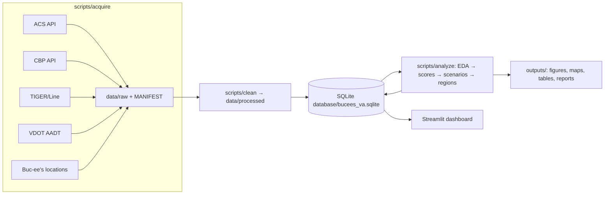

# Architecture

## Analytical question
Which Virginia counties and regional highway markets should Buc-ee's
prioritize for future expansion?

Buc-ee's site model (very large travel centers on major highway corridors,
drawing customers from 50+ miles) implies the decision variables are:
traffic exposure on major corridors, market size and growth, purchasing
power, existing competition, and distance from other Buc-ee's stores.

## Unit of analysis
Virginia county-equivalents (counties + independent cities), keyed by
5-digit GEOID (state FIPS `51` + 3-digit county FIPS). Independent cities are
retained because they interrupt county geography on every VA corridor;
region-level aggregation (Stage 8) merges them back into functional markets.

## Data flow

## Pipeline contracts
- **Raw is immutable.** `data/raw/` files are never edited; every file is
  logged in `data/raw/MANIFEST.md` (source URL, access date, size, rows).
- **Idempotent stages.** Every script can be re-run; outputs are overwritten
  deterministically. `scripts/run_pipeline.py` sequences them and stops on
  the first non-zero exit.
- **Validation as data.** Each stage writes pass/warn/fail checks to the
  `validation_results` table via `scripts/utils/validation.py`.
- **Configuration over constants.** Years, URLs, variable codes, CRS, and
  all scenario weights live in `config/config.yaml`.

## Scoring design (Stage 6)
Eight component scores per county, each min-max normalized to 0-100 across
Virginia county-equivalents (higher = more attractive for expansion):

| Component | Primary inputs |
|---|---|
| market_demand | population, households |
| growth | change between ACS 2014-2018 and 2019-2023 |
| purchasing_power | median household income, per-capita income |
| highway_opportunity | max/interstate AADT, VMT proxy |
| accessibility | distance from county centroid to nearest interstate |
| commercial_activity | CBP establishments (retail, food service) per capita |
| competition | inverse of gas-station density (NAICS 457) |
| overlap_risk | inverse of proximity to existing/announced Buc-ee's |

Scenario rankings (Stage 7) are weighted sums of the components with weights
from `config/config.yaml`; weights are validated to sum to 1.0.

## Technology choices
- **SQLite + SQLAlchemy**: single-file, zero-config, reproducible; views in
  `sql/` demonstrate SQL competence.
- **GeoPandas + EPSG:26918 (UTM 18N)**: metric CRS suited to Virginia for
  distances/areas; EPSG:4326 for display.
- **Parquet (PyArrow)** for processed tables; CSV kept where recruiter
  readability matters.
- **Plotly + Streamlit** for interactive visuals and the executive dashboard.
